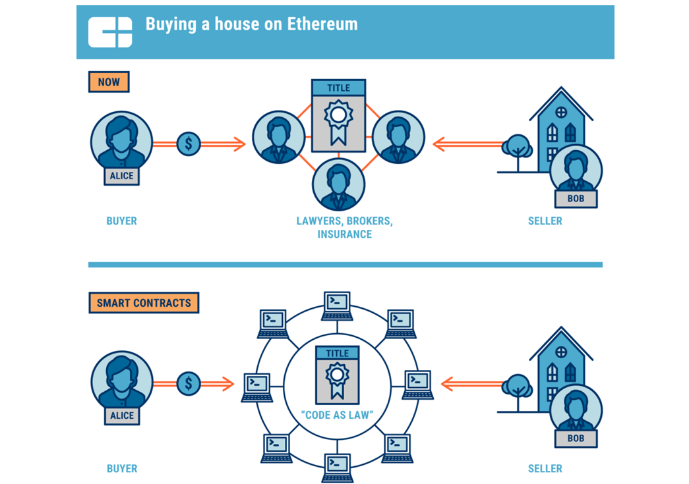

# Crypto Estate

## The first of a kind Blockchain based solution for temperproof Real Estate Buying/Selling With Visual Approach.



#### Project by Team Crypto Estatians

Crypto Estate is a Real Estate Buying/Selling based on Decentralised Ethereum and Matic Blockchain Network. An attempt to improve India's current Real Estate Buying/Selling Way with more Visual approach

- NO more tampering of properties as it is secured through Blockchain Technology
- Only the owner(Which will be goverment) of the contact can put the land for commercial use, so no more taking away any land.
- Buyers can choose land directly ,Eliminating the need of brokers, goverment and thus reducing the cost.
- Implemented Google Maps api thus eliminating the need of going through all random text of properties without location.
- Added Portis support thus no need to go hassel process of metamask and all

Our project uses Blockchain and Smart Etherum contracts to make sure each and every property is being stored peer to peer in a decentralized network with Hashing so that every property is secured.

## Simple Steps :

1.  **Portis Wallet Needed.**
2.  **Click on the property marker on google map you want to buy and is forsale.**
3.  **Fill details.**
4.  **Congrats Property is yours.**

## Tech Stack

```sh
 Truffle
 React
 Matic
 Portis
 Google Maps API
 Ganache (Development)
 Metamask (Development)
 Material UI
 Chartjs
```

## Installation

(This repository and main server)
Install the dependencies and start the server.

```sh
$ cd Crypto-Estate
$ cd client
$ npm install
$ npm start
```

### Contribute

Want to contribute? Great!
just make an issue and we'll respond
or better just make a PR

# Contributors

- [Yash Srivastava](https://github.com/darkshredder)
- [Samarpan Dutta](https://github.com/smrpn)

## License

MIT
